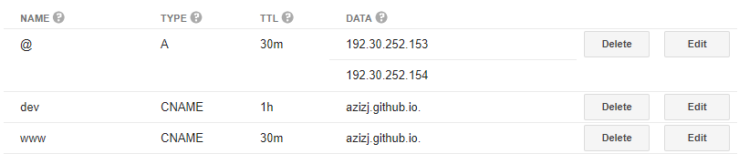

# BJJ Analytics
React web app that uses [Highcharts](https://www.highcharts.com/) to display useful metrics and graphs, using endpoints from [Google Calendar Analytics](https://0jhkh4pn4b.execute-api.us-east-1.amazonaws.com/prod/docs/) to get the data.

## Demo
The production version is live at [www.azizj1.com](www.azizj1.com). Dev version is at [dev.azizj1.com](dev.azizj1.com).

## Getting Started
This repo is a client for the analytics API, so it necessitates a couple of prerequisites.

### Prerequisites
* At least `npm`. Preferrably yarn installed globally (`npm i yarn -g`) in light of the `yarn.lock` file.
* The [analytics API](https://github.com/azizj1/google-calendar-analytics) server locally up and running.

### Developing
Install all project dependencies
```
yarn
```
Run server
```
cd ../google-calendar-analytics && yarn && yarn start && cd ../bjj-analytics
```
Kick off watcher with hot-reload
```
yarn start
```
To analyze webpack bundle and dependencies, run
```
yarn analyze
```

## Deployment
The website is deployed to [dev.azizj1.com](dev.azizj1.com) and [azizj1.com](www.azizj1.com) using [GitHub Pages](https://pages.github.com/).

### Prerequisites
Setup GitHub Pages:
1. Create two additional GitHub repos: one for dev/qa environment and another for prod.
2. Enable GitHub Pages through repo settings, making sure Source is set to `master branch`.
    - See https://github.com/azizj1/dev-azizj1 and https://github.com/azizj1/azizj1 for examples.
3. Update `./package.json` scripts (`scripts.deploy` and `scripts.deploy-prod`) with your repo URLs.
4. Configure your custom domain's DNS to route to Github Pages.

    
    
    **Note**: If your DNS is managed by Route53, you have profile `aws-cli` setup so it can at least query Route53 zones, create Route53 records, and write to S3 (terraform state file. If you don't want to use a remote state file, comment out `terraform { ...}` in `./terraform/config.tf`) run

    ```
    yarn custom-domain
    ```
    It'll prompt you for
    1. The S3 bucket to store the state file (if you decided to use remote state files), 
    2. Your domain name (e.g., azizj1.com, google.com, etc.). You **must** have a Route53 zone already created for this zone.

5. Update `./cnames.js` with your custom domain.

Server setup:
1. Deploy [analytics API](https://github.com/azizj1/google-calendar-analytics) to dev/prod.
2. Update `./endpoint.js` with your base URLs for the respective environments. 

### Dev Environment
```
yarn deploy
```

### Prod Environment
```
yarn deploy-prod
```

## License
MIT License

Copyright (c) 2018 Aziz Javed

Permission is hereby granted, free of charge, to any person obtaining a copy
of this software and associated documentation files (the "Software"), to deal
in the Software without restriction, including without limitation the rights
to use, copy, modify, merge, publish, distribute, sublicense, and/or sell
copies of the Software, and to permit persons to whom the Software is
furnished to do so, subject to the following conditions:

The above copyright notice and this permission notice shall be included in all
copies or substantial portions of the Software.

THE SOFTWARE IS PROVIDED "AS IS", WITHOUT WARRANTY OF ANY KIND, EXPRESS OR
IMPLIED, INCLUDING BUT NOT LIMITED TO THE WARRANTIES OF MERCHANTABILITY,
FITNESS FOR A PARTICULAR PURPOSE AND NONINFRINGEMENT. IN NO EVENT SHALL THE
AUTHORS OR COPYRIGHT HOLDERS BE LIABLE FOR ANY CLAIM, DAMAGES OR OTHER
LIABILITY, WHETHER IN AN ACTION OF CONTRACT, TORT OR OTHERWISE, ARISING FROM,
OUT OF OR IN CONNECTION WITH THE SOFTWARE OR THE USE OR OTHER DEALINGS IN THE
SOFTWARE.
